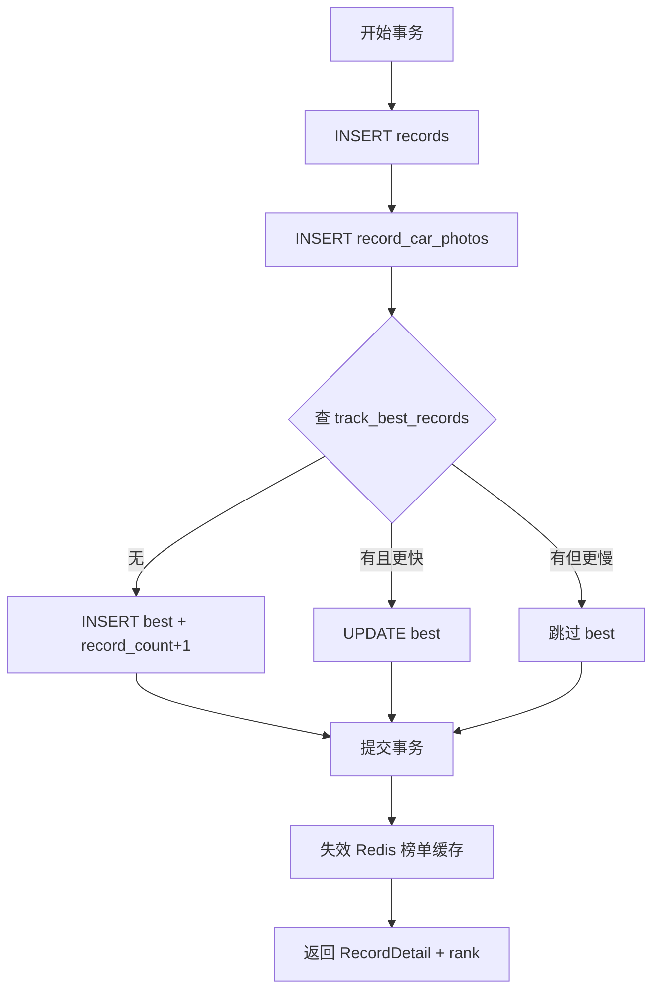

# 圈速与榜单模块（M03）

| 版本 | 日期 | 说明 |
|------|------|------|
| v1.0 | 2026-06-18 | 初版 |

> 依赖：M01、M02、M05  
> 被依赖：M02（榜单摘要）  
> 接口契约：[架构设计](../架构设计.md) §5.4

---

## 1. 模块职责

| 职责 | 说明 |
|------|------|
| 成绩提交 | 车手上传圈速 + 认定视频 |
| 历史记录 | 保存每次提交（含未刷新最佳的慢圈） |
| 榜单计算 | 每用户每赛道仅最佳成绩上榜 |
| 排名查询 | 分页榜单、个人排名 |
| 成绩详情 | 视频、配置单、照片展示 |
| 主理人视图 | 查看本赛道全部成绩条目 |

---

## 2. 内部结构

```
modules/record/
├── record.controller.ts
├── record.service.ts           # IRecordService
├── leaderboard.service.ts      # ILeaderboardService
├── record.repository.ts
├── bestRecord.repository.ts    # track_best_records
├── lapTime.util.ts             # 解析/格式化/校验
├── rank.calculator.ts          # 排名 SQL 或缓存
└── dto/
    ├── submit-record.dto.ts
    └── leaderboard.query.ts
```

---

## 3. 圈速时间处理

### 3.1 输入格式

用户输入：`分:秒.毫秒` 或 `秒.毫秒`

| 示例 | 含义 |
|------|------|
| `0:32.58` | 32 秒 580 毫秒 |
| `32.58` | 同上（不足 1 分钟） |
| `1:05.120` | 1 分 5 秒 120 毫秒 |

### 3.2 解析规则（`lapTime.util.ts`）

```typescript
function parseLapTime(input: string): { ms: number; display: string } {
  // 1. trim，拒绝空串
  // 2. 若含 ':' → 分:秒.毫秒
  // 3. 否则 → 秒.毫秒
  // 4. 毫秒补齐 3 位存储，展示保留用户精度或统一 3 位
  // 5. 范围：1ms ≤ ms ≤ 5999999（99:59.999）
}
```

**非法输入** → 40001 `圈速格式不正确，示例：0:32.58`

### 3.3 展示格式化

```typescript
function formatLapTime(ms: number): string {
  if (ms < 60000) return `${(ms/1000).toFixed(3)}`; // 或 SS.mmm
  const min = Math.floor(ms / 60000);
  const sec = ((ms % 60000) / 1000).toFixed(3);
  return `${min}:${sec.padStart(6, '0')}`;
}
```

---

## 4. 功能详细设计

### 4.1 提交成绩

**POST `/records`**

```json
{
  "trackId": "uuid",
  "lapTimeDisplay": "0:32.58",
  "videoUrl": "https://cdn.../record.mp4",
  "configSheet": {
    "type": "text",
    "content": "马达 XX，电池 1.2V×4，齿轮 8.2:1"
  },
  "carPhotoUrls": ["https://cdn.../car1.jpg"],
  "note": "今日风大"
}
```

**configSheet 二选一**

```json
{ "type": "image", "url": "https://cdn.../config.jpg" }
```

**校验**

| 项 | 规则 |
|----|------|
| trackId | 必须存在（调 M02 `exists`） |
| lapTimeDisplay | 解析成功 |
| videoUrl | 必填 HTTPS |
| carPhotoUrls | 0–3 |
| note | ≤ 100 字 |

**事务流程**



**first_achieved_at 规则**

- 新 INSERT best：`first_achieved_at = NOW()`
- UPDATE 且 `lap_time_ms` 更小：`first_achieved_at = NOW()`
- 相同 `lap_time_ms`：保留原 `first_achieved_at`

**Response**

```json
{
  "id": "record-uuid",
  "trackId": "...",
  "trackName": "...",
  "user": { "id", "nickName", "avatarUrl" },
  "lapTimeDisplay": "0:32.580",
  "lapTimeMs": 32580,
  "videoUrl": "...",
  "configSheet": { "type": "text", "content": "..." },
  "carPhotoUrls": [],
  "note": "...",
  "rank": 8,
  "isPersonalBest": true,
  "createdAt": "..."
}
```

`rank`：提交后即时计算（查 `track_best_records` 中该 user 的排名）。

### 4.2 圈速榜

**GET `/leaderboards/:trackId`**

| Query | 说明 |
|-------|------|
| page, pageSize | 默认 pageSize=20 |

**数据源**：`track_best_records` JOIN `users`

**排序**：`lap_time_ms ASC, first_achieved_at ASC`

**Response**

```json
{
  "trackId": "...",
  "trackName": "...",
  "total": 42,
  "list": [
    {
      "rank": 1,
      "recordId": "...",
      "userId": "...",
      "nickName": "...",
      "avatarUrl": "...",
      "lapTimeDisplay": "0:32.580"
    }
  ],
  "myRank": {
    "rank": 8,
    "recordId": "...",
    "lapTimeDisplay": "0:35.200"
  }
}
```

- `myRank`：仅登录且该用户有 best 记录时返回
- 前三名客户端加金/银/铜样式

**缓存**

```
Key: lb:{trackId}:p{page}:s{pageSize}
TTL: 60s
失效：该 track 有新 best 写入
```

### 4.3 成绩详情

**GET `/records/:id`**

```json
{
  "id": "...",
  "track": { "id", "name" },
  "user": { "id", "nickName", "avatarUrl" },
  "lapTimeDisplay": "0:32.580",
  "rank": 3,
  "videoUrl": "...",
  "configSheet": { ... },
  "carPhotoUrls": ["..."],
  "note": "...",
  "createdAt": "..."
}
```

**rank**：`resolveRank(trackId, recordId)`

- 若该 record 不是用户 best，仍展示 **该次提交** 的数据，但 `rank` 标注为「非最佳」或显示其 best 的排名 — **MVP 方案**：详情页 rank 始终指 **该 record 对应 best 的排名**；若 recordId ≠ best.recordId，额外字段 `isBestRecord: false`

### 4.4 我的成绩

**GET `/records/mine`**

- 登录用户全部 `records` 按 `created_at DESC`
- 列表项：`trackName`, `lapTimeDisplay`, `createdAt`, `isPersonalBest`（该 track 下是否等于 best）

### 4.5 主理人：赛道全部成绩

**GET `/tracks/:trackId/records`**

- 权限：`tracks.creator_id === auth.userId`
- 数据源：`records` 表（含非 best 的历史）
- 用于主理人查看所有认定视频

---

## 5. 排名算法

### 5.1 SQL 排名（MVP）

```sql
SELECT
  tbr.*,
  u.nick_name,
  u.avatar_url,
  (SELECT COUNT(*) + 1
   FROM track_best_records t2
   WHERE t2.track_id = tbr.track_id
     AND (t2.lap_time_ms < tbr.lap_time_ms
          OR (t2.lap_time_ms = tbr.lap_time_ms AND t2.first_achieved_at < tbr.first_achieved_at))
  ) AS rank
FROM track_best_records tbr
JOIN users u ON u.id = tbr.user_id
WHERE tbr.track_id = ?
ORDER BY tbr.lap_time_ms ASC, tbr.first_achieved_at ASC
LIMIT ? OFFSET ?;
```

### 5.2 resolveRank

对 `(trackId, recordId)`：

1. 找 `records.user_id`, `records.lap_time_ms`
2. 找该 user 的 `track_best_records.record_id`
3. 若 `recordId !== best.record_id` → 返回 best 的排名 + `isBestRecord: false`
4. 否则按 best 行计算 rank

---

## 6. 与 M05 协作

| purpose | 限制 |
|---------|------|
| `record_video` | mp4, ≤ 50MB, 建议 ≤ 120s（客户端选视频时校验） |
| `record_config` | jpg/png, ≤ 5MB |
| `record_car_photo` | jpg/png, ≤ 5MB, 最多 3 次上传 |

上传流程同赛道模块。

---

## 7. 客户端页面映射

| 页面 | API |
|------|-----|
| `pages/leaderboard/index` | GET `/leaderboards/:trackId` |
| `pages/record/submit` | POST `/records` |
| `pages/record/detail` | GET `/records/:id` |
| `pages/user/records` | GET `/records/mine` |

**提交页流程**

```
1. 从 route 带 trackId
2. 展示赛道名 + 认定说明链接
3. 输入圈速（自定义组件：分/秒/毫秒）
4. wx.chooseMedia 选视频 → 上传
5. 可选配置单/照片
6. 确认页 → POST
7. 成功 → redirect 榜单或详情
```

---

## 8. 错误码

| code | message |
|------|---------|
| 40402 | 赛道不存在 |
| 40403 | 成绩不存在 |
| 40002 | 圈速格式不正确 |
| 40003 | 最多上传 3 张车辆照片 |
| 40302 | 无权查看该赛道全部成绩 |

---

## 9. 测试要点

| 用例 | 预期 |
|------|------|
| 首次提交 | 上榜，record_count+1 |
| 提交更慢一圈 | 有 history，榜单不变 |
| 提交更快 | best 更新，排名上升 |
| 两人同圈速 | 先达到者靠前 |
| 榜单分页 | rank 连续正确 |
| 未登录看榜 | 无 myRank |

---

*相关：[赛道模块](./赛道模块.md) · [数据库设计](../数据库设计.md) §3.5–3.7*
