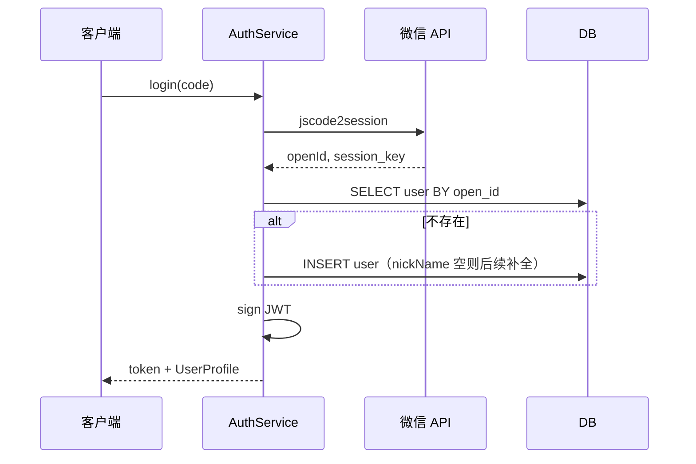

# 用户与认证模块（M01）

| 版本 | 日期 | 说明 |
|------|------|------|
| v1.0 | 2026-06-18 | 初版 |

> 依赖：M00 共享内核  
> 被依赖：M02、M03、M04、M05  
> 接口契约：[架构设计](../架构设计.md) §5.2

---

## 1. 模块职责

| 职责 | 说明 |
|------|------|
| 微信登录 | `code` 换 `openId`，注册/登录合一 |
| 会话管理 | 签发与校验 JWT |
| 用户资料 | 读写昵称、头像 |
| 权限上下文 | 为下游模块提供 `AuthContext` |
| 公开用户信息 | 批量查询，供榜单、社区展示 |

**不负责**：角色 RBAC 细粒度配置（MVP 用「是否赛道创建者」隐式判断主理人权限）。

---

## 2. 内部结构

```
modules/auth/
├── auth.controller.ts      # HTTP 入口
├── auth.service.ts         # loginByWechat, resolveToken
├── user.service.ts         # profile CRUD, getPublicProfiles
├── user.repository.ts
├── wechat.client.ts        # code2Session 封装
├── jwt.util.ts
└── dto/
    ├── login.dto.ts
    └── update-profile.dto.ts
```

---

## 3. 功能详细设计

### 3.1 微信登录

**触发**：客户端 `wx.login()` 获 `code` → `POST /auth/login`

**流程**



**Request**

```json
{ "code": "081xYz..." }
```

**Response `data`**

```json
{
  "token": "eyJhbG...",
  "expiresIn": 604800,
  "user": {
    "id": "uuid",
    "nickName": "四驱小子",
    "avatarUrl": "https://...",
    "isOrganizer": false,
    "createdAt": "2026-06-18T10:00:00.000Z"
  }
}
```

**规则**

- `isOrganizer`：`EXISTS(tracks WHERE creator_id = user.id)`
- 登录成功后客户端持久化 `token` 至 `wx.setStorageSync('token')`
- 微信 session_key **不入库**、不下发客户端

**错误**

| 场景 | code | message |
|------|------|---------|
| code 无效 | 40001 | 登录凭证无效，请重试 |
| 微信服务异常 | 50000 | 微信服务暂不可用 |

### 3.2 Token 校验（中间件）

**中间件**：`authMiddleware({ required: boolean })`

```typescript
// 伪代码
async function authMiddleware(ctx, next) {
  const token = parseBearer(ctx.headers.authorization);
  if (!token) {
    if (required) throw Unauthorized;
    ctx.state.auth = null;
    return next();
  }
  ctx.state.auth = await userService.resolveToken(token);
  return next();
}
```

**JWT Payload**

```json
{
  "sub": "user-uuid",
  "iat": 1718697600,
  "exp": 1719302400
}
```

**resolveToken 逻辑**

1. 验证签名与过期
2. 读 `users` 表确认用户存在
3. 组装 `AuthContext`

### 3.3 获取 / 更新资料

**GET `/users/me`**（需登录）

与登录返回的 `user` 结构一致。

**PATCH `/users/me`**

```json
{
  "nickName": "新昵称",
  "avatarUrl": "https://cdn.../avatar.jpg"
}
```

| 字段 | 规则 |
|------|------|
| nickName | 1–32 字，过滤敏感词（v1 简单黑名单） |
| avatarUrl | 必须是 HTTPS；MVP 允许微信头像 URL |

### 3.4 批量公开信息（模块间）

**方法**：`getPublicProfiles(userIds: string[])`

**返回**：Map，缺失 ID 忽略（不抛错）

**用途**

- M03 榜单列表填充昵称头像
- M04 帖子/评论作者信息
- 避免 N+1：一次 IN 查询

---

## 4. HTTP API Schema

### POST `/auth/login`

见 §3.1。

### POST `/auth/refresh`

需有效 token，签发新 token（旧 token 仍可用到过期，MVP 不做 blacklist）。

### GET `/users/me` / PATCH `/users/me`

见 §3.3。

---

## 5. 客户端集成

### 5.1 登录拦截

```typescript
// services/http.ts 伪代码
async function request(options) {
  const token = wx.getStorageSync('token');
  // ... 发起请求
  if (res.code === 40100) {
    await login(); // wx.login + POST /auth/login
    return request(options); // 重试一次
  }
}
```

### 5.2 需登录操作

| 页面/操作 | 行为 |
|-----------|------|
| 上传成绩 | 无 token → 弹授权引导 |
| 创建赛道 | 同上 |
| 发帖/评论/点赞/关注 | 同上 |
| 浏览榜单/社区 | 可不登录 |

### 5.3 昵称头像补全

首次登录若 `nickName` 为空，在需登录操作前调用：

```javascript
wx.getUserProfile({
  desc: '用于展示榜单与社区',
  success: (res) => patchUserMe(res.userInfo)
});
```

> 注：微信政策变动时用「头像昵称填写能力」组件替代。

---

## 6. 权限矩阵（模块内实现）

| 操作 | 校验 |
|------|------|
| 更新资料 | `auth.userId === 目标用户` |
| 创建赛道 | 已登录即可（登录即成为潜在主理人） |
| 编辑赛道 | `track.creatorId === auth.userId`（M02 校验） |

---

## 7. 数据访问

主表：`users`（见 [数据库设计](../数据库设计.md) §3.1）

**Repository 方法**

| 方法 | SQL 要点 |
|------|----------|
| findByOpenId | `WHERE open_id = ?` |
| findById | PK |
| findByIds | `WHERE id IN (...)` |
| create | INSERT |
| updateProfile | UPDATE nick_name, avatar_url |

---

## 8. 测试要点

| 用例 | 预期 |
|------|------|
| 新 openId 首次登录 | 创建用户并返回 token |
| 重复登录 | 同一 userId |
| 过期 token | 40100 |
| 更新昵称为空字符串 | 40001 |
| getPublicProfiles 空数组 | 返回空 Map |

---

## 9. 与其他模块接口

| 调用方向 | 接口 | 场景 |
|----------|------|------|
| 被 M02–M05 调用 | `resolveToken` | 中间件已注入，模块内读 `ctx.state.auth` |
| 被 M03/M04 调用 | `getPublicProfiles` | 列表渲染 |
| 客户端 | HTTP `/auth/*`, `/users/me` | 登录与资料 |

---

*下一模块：[赛道模块](./赛道模块.md)*
