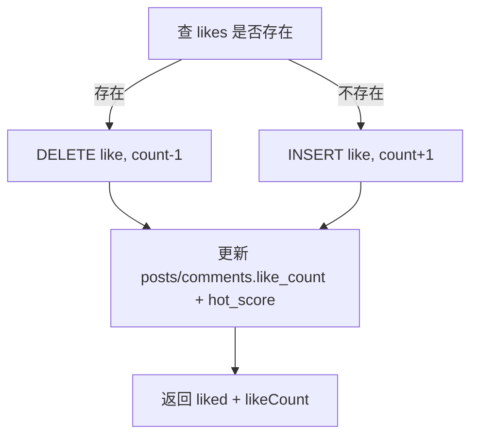

# 社区模块（M04）

| 版本 | 日期 | 说明 |
|------|------|------|
| v1.0 | 2026-06-18 | 初版 |

> 依赖：M01、M02（可选 trackId 校验）、M05  
> 被依赖：无  
> 接口契约：[架构设计](../架构设计.md) §5.5

---

## 1. 模块职责

| 职责 | 说明 |
|------|------|
| 板块管理 | 4 个预设板块只读列表 |
| 帖子 | 发帖、列表、详情 |
| 评论 | 一级评论（v1 无楼中楼） |
| 点赞 | 帖子/评论 toggle |
| 关注 | 用户间关注关系 |
| 关注流 | 我关注的人发的帖 |

**不负责**：私信、@ 提醒、内容审核后台（v1 举报走「联系客服」）。

---

## 2. 内部结构

```
modules/community/
├── board.controller.ts
├── post.controller.ts
├── social.controller.ts
├── board.service.ts
├── post.service.ts
├── social.service.ts
├── post.repository.ts
├── comment.repository.ts
├── like.repository.ts
├── follow.repository.ts
├── hotScore.util.ts
└── dto/
    ├── create-post.dto.ts
    ├── post-list.query.ts
    └── create-comment.dto.ts
```

---

## 3. 板块

### 3.1 列表

**GET `/boards`**

```json
{
  "list": [
    {
      "id": "track_event",
      "name": "赛道/赛事专区",
      "description": "赛道活动、赛事通知、圈速讨论",
      "sortOrder": 1
    }
  ]
}
```

数据来自 `boards` 种子表，无写接口。

### 3.2 客户端 Tab

社区首页顶部 Tab 与 `boards.list` 顺序一致，`boardId` 作为 query 切换帖子流。

---

## 4. 帖子

### 4.1 发帖

**POST `/posts`**（需登录，频率限制 10 次/小时）

```json
{
  "boardId": "driver_chat",
  "title": "这款马达怎么配齿轮",
  "content": "刚入手 XX 马达，跑公园赛道用什么齿比合适？",
  "imageUrls": ["https://cdn.../1.jpg"],
  "trackId": "uuid-optional"
}
```

**校验**

| 字段 | 规则 |
|------|------|
| boardId | 必须存在于 boards |
| title | 1–50 字 |
| content | 1–5000 字 |
| imageUrls | 0–9 |
| trackId | 若传则 M02 `exists` |

**流程**

1. INSERT posts
2. INSERT post_images
3. 返回 PostDetail

### 4.2 帖子列表

**GET `/posts`**

| Query | 说明 |
|-------|------|
| boardId | 必填 |
| sort | `latest`（默认）\| `hot` |
| page, pageSize | 分页 |

**排序**

- `latest`：`created_at DESC`
- `hot`：`hot_score DESC, created_at DESC`

**PostListItem**

```json
{
  "id": "...",
  "title": "...",
  "summary": "正文前 80 字...",
  "boardId": "driver_chat",
  "author": { "id", "nickName", "avatarUrl" },
  "track": { "id", "name" },
  "likeCount": 12,
  "commentCount": 5,
  "createdAt": "...",
  "coverImage": "首张图或 null"
}
```

登录时可选批量附加 `liked: boolean`（查 likes 表）。

### 4.3 帖子详情

**GET `/posts/:id`**

```json
{
  "id": "...",
  "boardId": "...",
  "boardName": "...",
  "title": "...",
  "content": "完整正文",
  "imageUrls": ["..."],
  "track": { "id", "name" },
  "author": { "id", "nickName", "avatarUrl" },
  "likeCount": 12,
  "commentCount": 5,
  "liked": false,
  "authorFollowed": false,
  "createdAt": "..."
}
```

- `authorFollowed`：登录 viewer 是否关注作者
- 未登录：`liked`、`authorFollowed` 均为 false

### 4.4 关注流

**GET `/posts/following`**

- 需登录
- SQL 思路：

```sql
SELECT p.* FROM posts p
JOIN follows f ON f.followee_id = p.author_id AND f.follower_id = ?
ORDER BY p.created_at DESC
LIMIT ? OFFSET ?;
```

---

## 5. 评论

### 5.1 列表

**GET `/posts/:postId/comments`**

```json
{
  "list": [
    {
      "id": "...",
      "content": "试试 7.5:1",
      "author": { "id", "nickName", "avatarUrl" },
      "likeCount": 2,
      "liked": false,
      "createdAt": "..."
    }
  ],
  "total": 20,
  "page": 1,
  "pageSize": 20,
  "hasMore": false
}
```

排序：`created_at ASC`（时间正序，符合论坛习惯）

### 5.2 发表评论

**POST `/posts/:postId/comments`**

```json
{ "content": "试试 7.5:1" }
```

| 规则 | 值 |
|------|-----|
| content | 1–500 字 |
| 频率 | 30 次/小时 |

**副作用**

1. INSERT comments
2. `posts.comment_count += 1`
3. 更新 `hot_score`

---

## 6. 点赞

**POST `/social/like`**

```json
{
  "targetType": "post",
  "targetId": "uuid"
}
```

或 `"targetType": "comment"`

**逻辑（toggle）**



**Response**

```json
{ "liked": true, "likeCount": 13 }
```

**约束**：`UNIQUE(user_id, target_type, target_id)` 防重复。

---

## 7. 关注

### 7.1 Toggle

**POST `/social/follow`**

```json
{ "followeeId": "user-uuid" }
```

- 不能关注自己 → 40001
- toggle 逻辑同点赞

**Response**

```json
{ "following": true }
```

### 7.2 我的关注列表

**GET `/social/following`**

```json
{
  "list": [
    { "id", "nickName", "avatarUrl", "followedAt" }
  ]
}
```

---

## 8. hot_score 维护

```typescript
function calcHotScore(likeCount: number, commentCount: number): number {
  return likeCount * 2 + commentCount * 3;
}
```

在以下时机更新 `posts.hot_score`：

- createComment 后
- toggleLike（target 为 post）后

---

## 9. 分享（客户端）

不涉及后端 API，使用：

```javascript
onShareAppMessage() {
  return {
    title: post.title,
    path: `/pages/community/post?id=${post.id}`
  };
}
```

赛道、榜单分享同理，path 带 query。

---

## 10. 与 M02 弱关联

- 发帖可选 `trackId`
- 赛道详情页可增加「相关讨论」入口：`GET /posts?boardId=track_event&trackId=xxx`（**扩展 query**，MVP 可在 post 列表加 `trackId` 筛选）

**GET `/posts?boardId=...&trackId=...`**

可选参数 `trackId` 过滤 `posts.track_id`。

---

## 11. 错误码

| code | message |
|------|---------|
| 40404 | 帖子不存在 |
| 40405 | 评论不存在 |
| 40004 | 标题或正文长度不符 |
| 40005 | 不能关注自己 |
| 42901 | 发帖过于频繁 |

---

## 12. 客户端页面映射

| 页面 | 行为 |
|------|------|
| `pages/community/index` | GET boards + GET posts |
| `pages/community/create` | POST posts + media |
| `pages/community/post` | GET post + comments + like/comment/follow |
| `pages/user/following` | GET social/following + 跳转作者帖 |

**FAB 发帖**：当前 Tab 的 `boardId` 预填。

---

## 13. 内容安全（v1 最小）

| 措施 | 说明 |
|------|------|
| 长度限制 | 防刷屏 |
| 频率限制 | Redis 计数 |
| 敏感词 | 简单本地词库替换为 `*` |
| 举报 | 帖子/评论长按 → 复制客服微信号（配置项） |

后续可接微信 `msgSecCheck` 内容安全 API。

---

## 14. 测试要点

| 用例 | 预期 |
|------|------|
| 发帖无 boardId | 40001 |
| 热门排序 | hot_score 大的靠前 |
| 重复点赞 | toggle 取消 |
| 评论后 commentCount | +1 |
| 关注流 | 仅看到被关注用户帖 |
| 带 trackId 发帖 | 详情展示赛道名 |

---

*相关：[用户认证模块](./用户认证模块.md) · [媒体服务模块](./媒体服务模块.md)*
