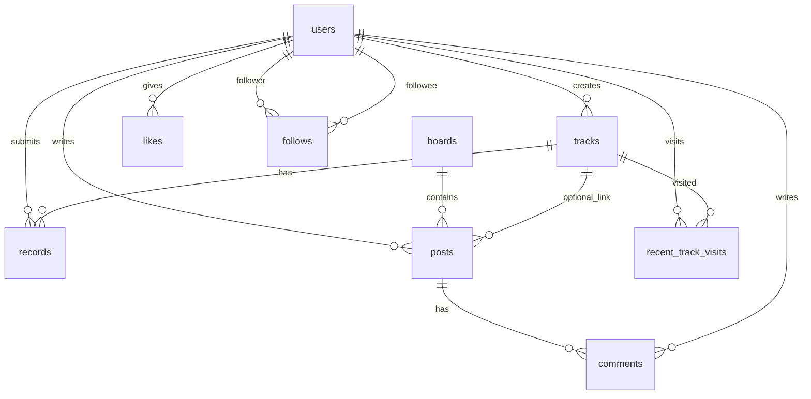

# 数据库设计

| 版本 | 日期 | 说明 |
|------|------|------|
| v1.0 | 2026-06-18 | 初版 |

> 架构参考：[架构设计](./架构设计.md)

---

## 1. ER 关系概览



---

## 2. 表清单

| 表名 | 模块 | 说明 |
|------|------|------|
| `users` | M01 | 用户 |
| `tracks` | M02 | 赛道 |
| `track_floor_plans` | M02 | 赛道平面图（1:N） |
| `recent_track_visits` | M02 | 最近访问 |
| `records` | M03 | 圈速成绩（全量历史） |
| `track_best_records` | M03 | 每用户每赛道最佳（榜单源表） |
| `boards` | M04 | 社区板块（预设数据） |
| `posts` | M04 | 帖子 |
| `post_images` | M04 | 帖子图片 |
| `comments` | M04 | 评论 |
| `likes` | M04 | 点赞 |
| `follows` | M04 | 关注 |
| `media_objects` | M05 | 已确认媒体元数据 |

---

## 3. 表结构 DDL

### 3.1 users

```sql
CREATE TABLE users (
  id            CHAR(36)     PRIMARY KEY COMMENT 'UUID',
  open_id       VARCHAR(64)  NOT NULL UNIQUE COMMENT '微信 openId',
  union_id      VARCHAR(64)  NULL COMMENT '微信 unionId',
  nick_name     VARCHAR(64)  NOT NULL DEFAULT '',
  avatar_url    VARCHAR(512) NOT NULL DEFAULT '',
  created_at    DATETIME(3)  NOT NULL DEFAULT CURRENT_TIMESTAMP(3),
  updated_at    DATETIME(3)  NOT NULL DEFAULT CURRENT_TIMESTAMP(3) ON UPDATE CURRENT_TIMESTAMP(3),
  INDEX idx_users_created (created_at)
) ENGINE=InnoDB DEFAULT CHARSET=utf8mb4;
```

### 3.2 tracks

```sql
CREATE TABLE tracks (
  id                 CHAR(36)      PRIMARY KEY,
  creator_id         CHAR(36)      NOT NULL,
  name               VARCHAR(40)   NOT NULL COMMENT '赛道名称',
  lat                DECIMAL(10,7) NOT NULL,
  lng                DECIMAL(10,7) NOT NULL,
  address            VARCHAR(255)  NOT NULL,
  organizer_name     VARCHAR(64)   NOT NULL,
  organizer_contact  VARCHAR(128)  NULL,
  length_meters      INT UNSIGNED  NULL,
  example_video_url  VARCHAR(512)  NULL,
  rule_note          VARCHAR(500)  NULL COMMENT '成绩认定文字说明',
  record_count       INT UNSIGNED  NOT NULL DEFAULT 0 COMMENT '入榜人数冗余',
  created_at         DATETIME(3)   NOT NULL DEFAULT CURRENT_TIMESTAMP(3),
  updated_at         DATETIME(3)   NOT NULL DEFAULT CURRENT_TIMESTAMP(3) ON UPDATE CURRENT_TIMESTAMP(3),
  UNIQUE KEY uk_creator_name (creator_id, name),
  INDEX idx_tracks_geo (lat, lng),
  INDEX idx_tracks_created (created_at),
  CONSTRAINT fk_tracks_creator FOREIGN KEY (creator_id) REFERENCES users(id)
) ENGINE=InnoDB DEFAULT CHARSET=utf8mb4;
```

### 3.3 track_floor_plans

```sql
CREATE TABLE track_floor_plans (
  id         BIGINT UNSIGNED PRIMARY KEY AUTO_INCREMENT,
  track_id   CHAR(36)     NOT NULL,
  image_url  VARCHAR(512) NOT NULL,
  sort_order TINYINT      NOT NULL DEFAULT 0,
  INDEX idx_tfp_track (track_id),
  CONSTRAINT fk_tfp_track FOREIGN KEY (track_id) REFERENCES tracks(id) ON DELETE CASCADE
) ENGINE=InnoDB DEFAULT CHARSET=utf8mb4;
```

### 3.4 recent_track_visits

```sql
CREATE TABLE recent_track_visits (
  user_id    CHAR(36)    NOT NULL,
  track_id   CHAR(36)    NOT NULL,
  visited_at DATETIME(3) NOT NULL DEFAULT CURRENT_TIMESTAMP(3),
  PRIMARY KEY (user_id, track_id),
  INDEX idx_rtv_user_time (user_id, visited_at DESC),
  CONSTRAINT fk_rtv_user FOREIGN KEY (user_id) REFERENCES users(id) ON DELETE CASCADE,
  CONSTRAINT fk_rtv_track FOREIGN KEY (track_id) REFERENCES tracks(id) ON DELETE CASCADE
) ENGINE=InnoDB DEFAULT CHARSET=utf8mb4;
```

### 3.5 records

```sql
CREATE TABLE records (
  id                  CHAR(36)      PRIMARY KEY,
  track_id            CHAR(36)      NOT NULL,
  user_id             CHAR(36)      NOT NULL,
  lap_time_ms         INT UNSIGNED  NOT NULL COMMENT '圈速毫秒',
  lap_time_display    VARCHAR(16)   NOT NULL COMMENT '展示用原串',
  video_url           VARCHAR(512)  NOT NULL,
  config_sheet_type   ENUM('text','image') NULL,
  config_sheet_text   VARCHAR(1000) NULL,
  config_sheet_url    VARCHAR(512)  NULL,
  note                VARCHAR(100)  NULL,
  created_at          DATETIME(3)   NOT NULL DEFAULT CURRENT_TIMESTAMP(3),
  INDEX idx_records_track_time (track_id, lap_time_ms, created_at),
  INDEX idx_records_user (user_id, created_at DESC),
  CONSTRAINT fk_records_track FOREIGN KEY (track_id) REFERENCES tracks(id),
  CONSTRAINT fk_records_user FOREIGN KEY (user_id) REFERENCES users(id)
) ENGINE=InnoDB DEFAULT CHARSET=utf8mb4;
```

### 3.6 record_car_photos

```sql
CREATE TABLE record_car_photos (
  id         BIGINT UNSIGNED PRIMARY KEY AUTO_INCREMENT,
  record_id  CHAR(36)     NOT NULL,
  image_url  VARCHAR(512) NOT NULL,
  sort_order TINYINT      NOT NULL DEFAULT 0,
  INDEX idx_rcp_record (record_id),
  CONSTRAINT fk_rcp_record FOREIGN KEY (record_id) REFERENCES records(id) ON DELETE CASCADE
) ENGINE=InnoDB DEFAULT CHARSET=utf8mb4;
```

### 3.7 track_best_records（榜单源）

```sql
CREATE TABLE track_best_records (
  track_id           CHAR(36)     NOT NULL,
  user_id            CHAR(36)     NOT NULL,
  record_id          CHAR(36)     NOT NULL COMMENT '当前最佳对应 records.id',
  lap_time_ms        INT UNSIGNED NOT NULL,
  first_achieved_at  DATETIME(3)  NOT NULL COMMENT '首次达到该成绩时间',
  updated_at         DATETIME(3)  NOT NULL DEFAULT CURRENT_TIMESTAMP(3) ON UPDATE CURRENT_TIMESTAMP(3),
  PRIMARY KEY (track_id, user_id),
  INDEX idx_tbr_rank (track_id, lap_time_ms ASC, first_achieved_at ASC),
  CONSTRAINT fk_tbr_track FOREIGN KEY (track_id) REFERENCES tracks(id),
  CONSTRAINT fk_tbr_user FOREIGN KEY (user_id) REFERENCES users(id),
  CONSTRAINT fk_tbr_record FOREIGN KEY (record_id) REFERENCES records(id)
) ENGINE=InnoDB DEFAULT CHARSET=utf8mb4;
```

### 3.8 boards（预设）

```sql
CREATE TABLE boards (
  id          VARCHAR(32)  PRIMARY KEY COMMENT '如 track_event',
  name        VARCHAR(64)  NOT NULL,
  description VARCHAR(255) NULL,
  sort_order  TINYINT      NOT NULL DEFAULT 0,
  created_at  DATETIME(3)  NOT NULL DEFAULT CURRENT_TIMESTAMP(3)
) ENGINE=InnoDB DEFAULT CHARSET=utf8mb4;

INSERT INTO boards (id, name, description, sort_order) VALUES
('track_event', '赛道/赛事专区', '赛道活动、赛事通知、圈速讨论', 1),
('newbie',      '新手入门区',   '入门教程、规则科普', 2),
('driver_chat', '车手交流区',   '改装、手感、闲聊', 3),
('new_product', '新品发布区',   '装备新品、开箱', 4);
```

### 3.9 posts

```sql
CREATE TABLE posts (
  id            CHAR(36)     PRIMARY KEY,
  board_id      VARCHAR(32)  NOT NULL,
  author_id     CHAR(36)     NOT NULL,
  track_id      CHAR(36)     NULL COMMENT '关联赛道',
  title         VARCHAR(100) NOT NULL,
  content       TEXT         NOT NULL,
  like_count    INT UNSIGNED NOT NULL DEFAULT 0,
  comment_count INT UNSIGNED NOT NULL DEFAULT 0,
  hot_score     INT          NOT NULL DEFAULT 0 COMMENT '点赞+评论加权，列表排序',
  created_at    DATETIME(3)  NOT NULL DEFAULT CURRENT_TIMESTAMP(3),
  updated_at    DATETIME(3)  NOT NULL DEFAULT CURRENT_TIMESTAMP(3) ON UPDATE CURRENT_TIMESTAMP(3),
  INDEX idx_posts_board_latest (board_id, created_at DESC),
  INDEX idx_posts_board_hot (board_id, hot_score DESC, created_at DESC),
  INDEX idx_posts_author (author_id, created_at DESC),
  INDEX idx_posts_track (track_id, created_at DESC),
  CONSTRAINT fk_posts_board FOREIGN KEY (board_id) REFERENCES boards(id),
  CONSTRAINT fk_posts_author FOREIGN KEY (author_id) REFERENCES users(id),
  CONSTRAINT fk_posts_track FOREIGN KEY (track_id) REFERENCES tracks(id)
) ENGINE=InnoDB DEFAULT CHARSET=utf8mb4;
```

### 3.10 post_images

```sql
CREATE TABLE post_images (
  id         BIGINT UNSIGNED PRIMARY KEY AUTO_INCREMENT,
  post_id    CHAR(36)     NOT NULL,
  image_url  VARCHAR(512) NOT NULL,
  sort_order TINYINT      NOT NULL DEFAULT 0,
  INDEX idx_pi_post (post_id),
  CONSTRAINT fk_pi_post FOREIGN KEY (post_id) REFERENCES posts(id) ON DELETE CASCADE
) ENGINE=InnoDB DEFAULT CHARSET=utf8mb4;
```

### 3.11 comments

```sql
CREATE TABLE comments (
  id         CHAR(36)     PRIMARY KEY,
  post_id    CHAR(36)     NOT NULL,
  author_id  CHAR(36)     NOT NULL,
  content    VARCHAR(500) NOT NULL,
  like_count INT UNSIGNED NOT NULL DEFAULT 0,
  created_at DATETIME(3)  NOT NULL DEFAULT CURRENT_TIMESTAMP(3),
  INDEX idx_comments_post (post_id, created_at ASC),
  CONSTRAINT fk_comments_post FOREIGN KEY (post_id) REFERENCES posts(id) ON DELETE CASCADE,
  CONSTRAINT fk_comments_author FOREIGN KEY (author_id) REFERENCES users(id)
) ENGINE=InnoDB DEFAULT CHARSET=utf8mb4;
```

### 3.12 likes

```sql
CREATE TABLE likes (
  id          BIGINT UNSIGNED PRIMARY KEY AUTO_INCREMENT,
  user_id     CHAR(36)     NOT NULL,
  target_type ENUM('post','comment') NOT NULL,
  target_id   CHAR(36)     NOT NULL,
  created_at  DATETIME(3)  NOT NULL DEFAULT CURRENT_TIMESTAMP(3),
  UNIQUE KEY uk_like (user_id, target_type, target_id),
  INDEX idx_likes_target (target_type, target_id)
) ENGINE=InnoDB DEFAULT CHARSET=utf8mb4;
```

### 3.13 follows

```sql
CREATE TABLE follows (
  follower_id  CHAR(36)   NOT NULL,
  followee_id  CHAR(36)   NOT NULL,
  created_at   DATETIME(3) NOT NULL DEFAULT CURRENT_TIMESTAMP(3),
  PRIMARY KEY (follower_id, followee_id),
  INDEX idx_follows_followee (followee_id, created_at DESC),
  CONSTRAINT fk_follows_follower FOREIGN KEY (follower_id) REFERENCES users(id) ON DELETE CASCADE,
  CONSTRAINT fk_follows_followee FOREIGN KEY (followee_id) REFERENCES users(id) ON DELETE CASCADE
) ENGINE=InnoDB DEFAULT CHARSET=utf8mb4;
```

### 3.14 media_objects

```sql
CREATE TABLE media_objects (
  object_key   VARCHAR(255) PRIMARY KEY,
  user_id      CHAR(36)     NOT NULL,
  media_type   ENUM('image','video') NOT NULL,
  purpose      VARCHAR(32)  NOT NULL,
  public_url   VARCHAR(512) NOT NULL,
  file_size    INT UNSIGNED NOT NULL,
  status       ENUM('pending','confirmed') NOT NULL DEFAULT 'pending',
  created_at   DATETIME(3)  NOT NULL DEFAULT CURRENT_TIMESTAMP(3),
  confirmed_at DATETIME(3)  NULL,
  INDEX idx_media_user (user_id, created_at DESC),
  INDEX idx_media_pending (status, created_at)
) ENGINE=InnoDB DEFAULT CHARSET=utf8mb4;
```

---

## 4. 关键业务与表协作

### 4.1 提交成绩更新榜单

```
1. INSERT records
2. INSERT record_car_photos（若有）
3. UPSERT track_best_records
   - 若无记录 → INSERT
   - 若新 lap_time_ms 更小 → UPDATE record_id, lap_time_ms, first_achieved_at=NOW()
   - 若相等且更早 created_at → 更新 first_achieved_at（可选，一般不变）
   - 若更慢 → 跳过
4. 若 UPSERT 为新增 user → tracks.record_count + 1
5. 删除 Redis lb:{trackId}:*
```

### 4.2 热门帖 hot_score

```
hot_score = like_count * 2 + comment_count * 3
```

帖子详情加载评论/点赞后异步或同事务更新（MVP 可在 toggleLike/createComment 时同步更新）。

---

## 5. 索引策略摘要

| 查询 | 使用索引 |
|------|----------|
| 赛道列表按时间 | `tracks.created_at` |
| 赛道附近（MVP 粗筛） | 应用层 Haversine；数据量大时可加 GEO 扩展 |
| 榜单分页 | `track_best_records.idx_tbr_rank` |
| 板块最新帖 | `posts.idx_posts_board_latest` |
| 板块热门帖 | `posts.idx_posts_board_hot` |
| 关注流 | `follows` + `posts.author_id` 两次查询或 JOIN |

---

## 6. 迁移与种子数据

- 使用 **Flyway** 或 **Prisma Migrate** 管理版本
- `boards` 表随迁移脚本种子写入
- 禁止在生产直接改表；所有变更走 migration 文件

---

*模块字段用法详见各模块文档。*
