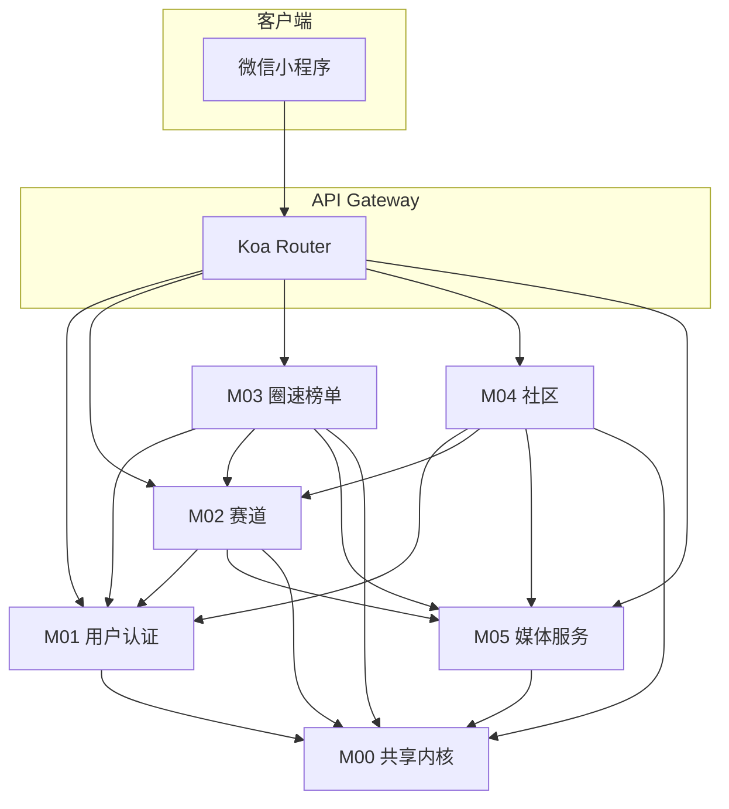
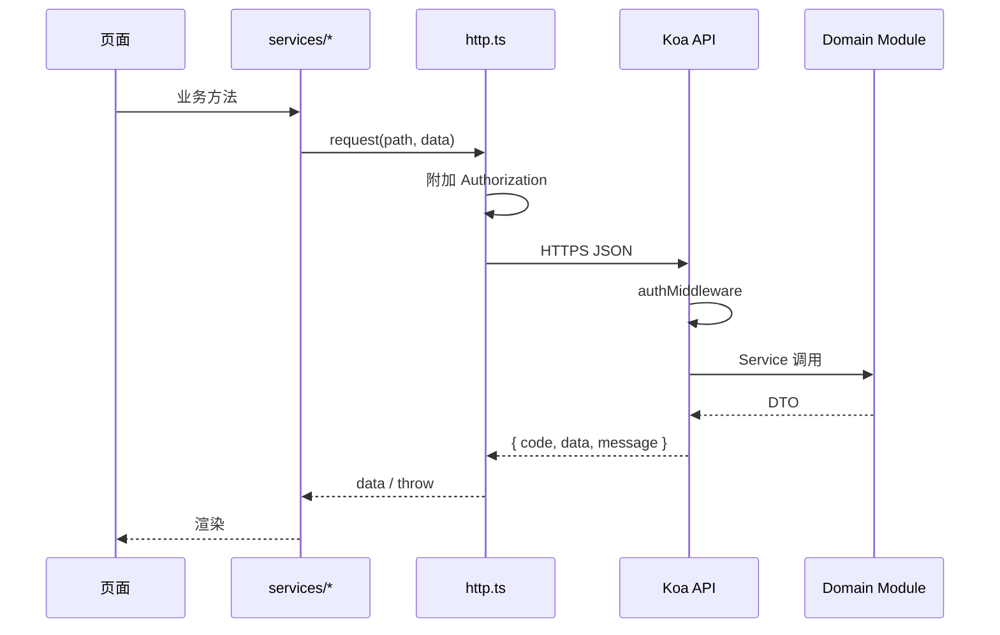
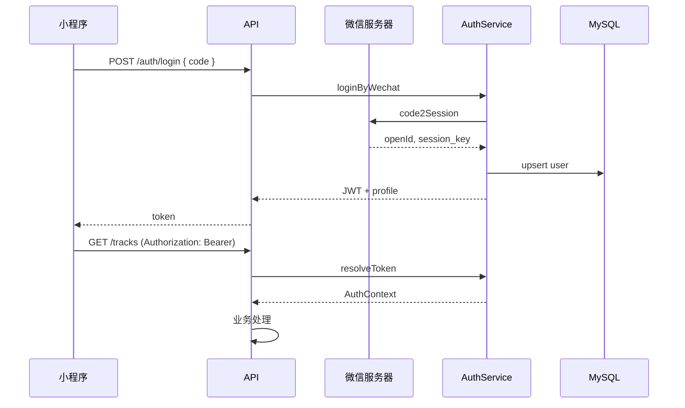
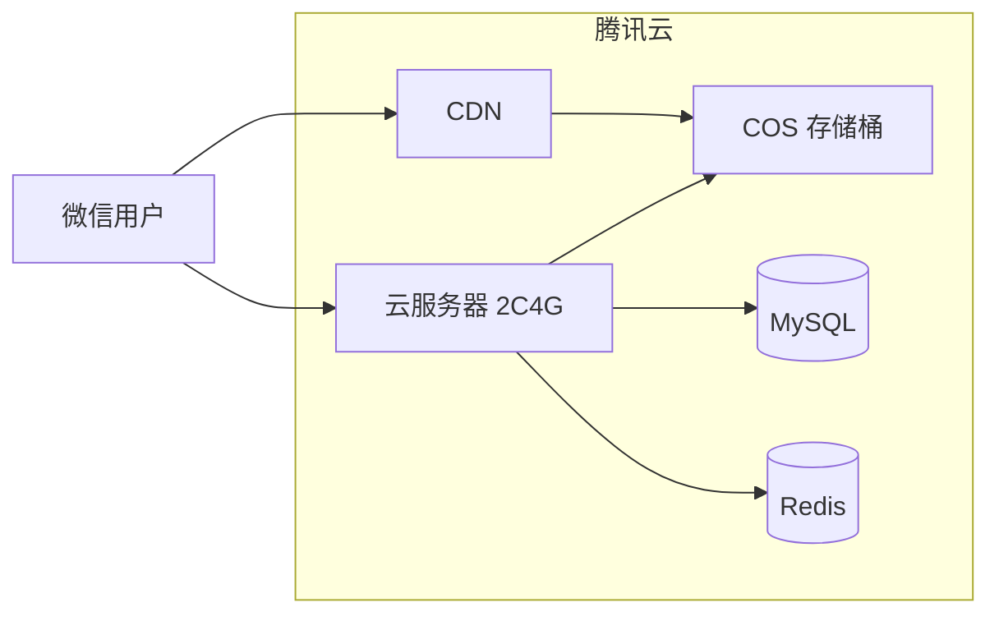

# 架构设计文档

| 版本 | 日期 | 说明 |
|------|------|------|
| v1.0 | 2026-06-18 | 初版 |
| v1.1 | 2026-06-18 | 新增 P0 官方包约束 |

> 产品需求来源：[产品设计文档](../产品设计文档.md)

---

## 0. 架构约束（P0 · 最高优先级）

> **本约束优先级高于本文档其余所有技术选型与依赖约定。** 发生冲突时，以本节为准。

### 0.1 官方包唯一原则

**所有引用的包（含 npm 依赖、SDK、CLI 工具）必须使用各平台/厂商提供的官方包，禁止引用任何第三方（社区或个人维护）的包。**

| 类别 | 允许（官方） | 禁止（第三方） |
|------|-------------|---------------|
| 微信小程序 | 微信官方 `wx.*` API、微信开发者工具 | 社区封装库、非官方 UI/工具包 |
| 腾讯云服务 | 腾讯云官方 SDK（如 COS、CDN 官方 Node SDK） | 非腾讯云发布的存储/鉴权封装 |
| 微信开放平台 | 微信官方服务端 API / 官方 SDK | 社区 JWT/登录封装、非官方中间件 |
| Node.js 运行时 | Node.js 内置模块（`http`、`crypto`、`fs` 等） | Koa、Express、ioredis 等社区框架/库 |
| 数据库访问 | MySQL / Redis 官方驱动或厂商客户端 | Prisma、TypeORM、Sequelize 等 ORM |
| 语言工具链 | TypeScript 官方编译器 | 非官方维护的替代编译器或转译工具 |

### 0.2 执行要求

1. **新增依赖前**：确认发布方为对应平台/厂商官方组织（如 `tencentcloud-sdk-nodejs`、微信开放文档所列 SDK），否则不得引入。
2. **代码审查**：`package.json` / `project.config.json` 中出现非官方包，一律退回。
3. **存量依赖**：与本文冲突的既有依赖须按演进路线逐步替换为官方方案。

---

## 1. 架构目标

| 目标 | 策略 |
|------|------|
| 模块边界清晰 | 按业务域拆分 5 个后端模块 + 1 个共享内核 |
| 接口稳定 | 模块间仅通过 Service Interface 调用，禁止跨模块直查表 |
| 可独立演进 | 社区、榜单可独立扩容；媒体走 COS 直传 |
| MVP 可交付 | 单体部署，单 MySQL 实例，Redis 可选降级 |

---

## 2. 系统上下文

```mermaid
C4Context
  title 系统上下文
  Person(driver, "车手", "上传圈速、看榜、逛社区")
  Person(organizer, "赛道主理人", "创建维护赛道")
  System(miniapp, "圈速打榜小程序", "微信小程序客户端")
  System_Ext(wechat, "微信开放平台", "登录、分享")
  System_Ext(cos, "腾讯云 COS/CDN", "图片视频存储")
  System_Ext(map, "地图服务", "选点、导航")

  driver --> miniapp
  organizer --> miniapp
  miniapp --> wechat
  miniapp --> map
  miniapp --> cos
  miniapp --> miniapp
```

**说明**：客户端经 HTTPS 调用自建 API；媒体文件经 **预签名 URL 直传 COS**，API 只保存元数据 URL。

---

## 3. 逻辑分层架构

```
┌─────────────────────────────────────────────────────────┐
│                    微信小程序客户端                        │
│  pages │ components │ services(api) │ stores │ utils    │
└───────────────────────────┬─────────────────────────────┘
                            │ HTTPS / JSON
┌───────────────────────────▼─────────────────────────────┐
│                      API Gateway 层                        │
│  路由 │ 鉴权中间件 │ 参数校验 │ 统一响应 │ 限流            │
└───────────────────────────┬─────────────────────────────┘
                            │
┌───────────────────────────▼─────────────────────────────┐
│                      业务模块层 (Domain)                   │
│ ┌──────────┐ ┌──────────┐ ┌──────────┐ ┌──────────┐    │
│ │用户认证   │ │  赛道    │ │圈速榜单   │ │  社区    │    │
│ └────┬─────┘ └────┬─────┘ └────┬─────┘ └────┬─────┘    │
│      │            │            │            │          │
│      └────────────┴─────┬──────┴────────────┘          │
│                          │                              │
│                   ┌──────▼──────┐                       │
│                   │  媒体服务    │                       │
│                   └─────────────┘                       │
└───────────────────────────┬─────────────────────────────┘
                            │
┌───────────────────────────▼─────────────────────────────┐
│                      基础设施层                            │
│  MySQL │ Redis │ COS SDK │ 微信 SDK │ 日志 │ 配置        │
└─────────────────────────────────────────────────────────┘
```

---

## 4. 模块划分与依赖

### 4.1 模块清单

| 模块 ID | 名称 | 包路径（建议） | 对外暴露 |
|---------|------|----------------|----------|
| `M01` | 用户与认证 | `modules/auth` | AuthService, UserService |
| `M02` | 赛道 | `modules/track` | TrackService |
| `M03` | 圈速与榜单 | `modules/record` | RecordService, LeaderboardService |
| `M04` | 社区 | `modules/community` | BoardService, PostService, SocialService |
| `M05` | 媒体服务 | `modules/media` | MediaService |
| `M00` | 共享内核 | `shared` | 错误码、分页、时间格式化、权限装饰器 |

### 4.2 依赖关系（单向）



**依赖规则**

1. `M04 社区` **不可** 依赖 `M03 圈速榜单`（避免耦合；关联赛道仅保存 `trackId`）
2. `M03` 依赖 `M02` 仅用于校验赛道存在性与读取赛道快照
3. `M05` 不依赖任何业务模块
4. 所有模块依赖 `M00`，`M00` 不依赖业务模块

---

## 5. 跨模块接口定义

以下为 **模块间 Service Interface**（TypeScript 契约）。HTTP 对外 API 见 [API接口总览](./API接口总览.md)。

### 5.1 共享类型（`shared/types`）

```typescript
/** 当前请求用户上下文，由鉴权中间件注入 */
interface AuthContext {
  userId: string;       // 内部 UUID
  openId: string;
  nickName: string;
  avatarUrl: string;
}

interface PaginationQuery {
  page: number;         // 从 1 开始
  pageSize: number;     // 默认 20，最大 50
}

interface PaginationResult<T> {
  list: T[];
  total: number;
  page: number;
  pageSize: number;
  hasMore: boolean;
}

interface GeoPoint {
  lat: number;
  lng: number;
  address: string;
}

/** 圈速：对外展示字符串，对内存储毫秒 */
type LapTimeDisplay = string;  // "0:32.580" | "32.580"
```

### 5.2 M01 — IUserService

```typescript
interface IUserService {
  /** 微信 code 换 token，不存在则自动注册 */
  loginByWechat(code: string): Promise<{ token: string; user: UserProfile }>;

  /** 校验 JWT，返回 AuthContext；失败抛 UnauthorizedError */
  resolveToken(token: string): Promise<AuthContext>;

  getProfile(userId: string): Promise<UserProfile>;
  updateProfile(userId: string, dto: UpdateProfileDto): Promise<UserProfile>;

  /** 批量获取用户公开信息（社区列表、榜单脱敏） */
  getPublicProfiles(userIds: string[]): Promise<Map<string, PublicUser>>;
}

interface UserProfile {
  id: string;
  nickName: string;
  avatarUrl: string;
  isOrganizer: boolean;   // 是否创建过赛道
  createdAt: string;
}

interface PublicUser {
  id: string;
  nickName: string;
  avatarUrl: string;
}
```

**调用方**：所有需登录模块、M04 作者展示、M03 榜单昵称。

### 5.3 M02 — ITrackService

```typescript
interface ITrackService {
  create(creatorId: string, dto: CreateTrackDto): Promise<TrackDetail>;
  update(trackId: string, operatorId: string, dto: UpdateTrackDto): Promise<TrackDetail>;
  getById(trackId: string): Promise<TrackDetail>;
  exists(trackId: string): Promise<boolean>;

  /** 公开列表：支持距离排序（传入用户坐标） */
  list(query: TrackListQuery): Promise<PaginationResult<TrackListItem>>;

  /** 主理人：我创建的赛道 */
  listByCreator(creatorId: string, query: PaginationQuery): Promise<PaginationResult<TrackListItem>>;

  /** 名称唯一性：同一 creatorId 下 */
  isNameDuplicate(creatorId: string, name: string, excludeId?: string): Promise<boolean>;

  /** 记录用户最近访问（首页快捷入口，最多 3 条） */
  touchRecentVisit(userId: string, trackId: string): Promise<void>;
  getRecentVisits(userId: string, limit?: number): Promise<TrackListItem[]>;

  /** 榜单摘要：Top1 + 入榜人数，供列表卡片 */
  getLeaderboardSummary(trackId: string): Promise<LeaderboardSummary>;
}

interface TrackDetail {
  id: string;
  name: string;
  location: GeoPoint;
  organizerName: string;
  organizerContact?: string;
  lengthMeters?: number;
  floorPlanUrls: string[];
  exampleVideoUrl?: string;
  ruleNote?: string;
  creatorId: string;
  recordCount: number;
  createdAt: string;
  updatedAt: string;
}

interface LeaderboardSummary {
  topRecord?: { userId: string; nickName: string; lapTimeDisplay: LapTimeDisplay };
  participantCount: number;  // 去重车手数
}
```

**调用方**：M03 提交成绩前校验赛道；M04 帖子关联赛道；客户端赛道页。

### 5.4 M03 — IRecordService / ILeaderboardService

```typescript
interface IRecordService {
  submit(userId: string, dto: SubmitRecordDto): Promise<RecordDetail>;

  getById(recordId: string): Promise<RecordDetail>;

  /** 某赛道下当前用户的最佳成绩 */
  getPersonalBest(userId: string, trackId: string): Promise<RecordBrief | null>;

  listByUser(userId: string, query: PaginationQuery): Promise<PaginationResult<RecordBrief>>;

  /** 主理人查看本赛道全部成绩 */
  listByTrack(trackId: string, operatorId: string, query: PaginationQuery): Promise<PaginationResult<RecordBrief>>;
}

interface ILeaderboardService {
  /** 榜单：每人仅保留最佳成绩参与排名 */
  getRanking(trackId: string, query: PaginationQuery): Promise<LeaderboardResult>;

  /** 计算某条成绩在当前榜单中的排名 */
  resolveRank(trackId: string, recordId: string): Promise<number>;
}

interface SubmitRecordDto {
  trackId: string;
  lapTimeDisplay: LapTimeDisplay;
  videoUrl: string;
  configSheet?: { type: 'text'; content: string } | { type: 'image'; url: string };
  carPhotoUrls?: string[];   // max 3
  note?: string;
}

interface LeaderboardResult {
  trackId: string;
  trackName: string;
  total: number;
  list: LeaderboardEntry[];
  myRank?: { rank: number; lapTimeDisplay: LapTimeDisplay; recordId: string };
}
```

**排名规则（模块内聚）**

- 同一 `userId + trackId` 仅 **最快一圈** 参与榜单
- 排序：`lapTimeMs ASC`, `firstAchievedAt ASC`（首次达到该成绩的时间）
- 写入时：若新成绩慢于已有最佳，仍保存记录但不更新榜单位

**调用方**：API 层、M02 的 `getLeaderboardSummary` 内部可调 M03 只读接口。

### 5.5 M04 — ICommunityServices

```typescript
interface IBoardService {
  listBoards(): Promise<Board[]>;
  getBoard(boardId: string): Promise<Board>;
}

interface IPostService {
  create(authorId: string, dto: CreatePostDto): Promise<PostDetail>;
  getById(postId: string, viewerId?: string): Promise<PostDetail>;
  list(query: PostListQuery): Promise<PaginationResult<PostListItem>>;
  listByAuthor(authorId: string, query: PaginationQuery): Promise<PaginationResult<PostListItem>>;
  listFollowingFeed(viewerId: string, query: PaginationQuery): Promise<PaginationResult<PostListItem>>;
}

interface ISocialService {
  toggleLike(userId: string, target: LikeTarget): Promise<{ liked: boolean; likeCount: number }>;
  createComment(userId: string, dto: CreateCommentDto): Promise<CommentItem>;
  listComments(postId: string, query: PaginationQuery): Promise<PaginationResult<CommentItem>>;
  toggleFollow(followerId: string, followeeId: string): Promise<{ following: boolean }>;
  listFollowing(userId: string, query: PaginationQuery): Promise<PaginationResult<PublicUser>>;
  isFollowing(followerId: string, followeeId: string): Promise<boolean>;
}

type LikeTarget =
  | { type: 'post'; id: string }
  | { type: 'comment'; id: string };
```

**调用方**：客户端社区 Tab；M02 可选提供「赛道相关帖子」跳转链接（只读 `trackId` 筛选，由 PostService 实现）。

### 5.6 M05 — IMediaService

```typescript
interface IMediaService {
  /** 获取 COS 预签名上传凭证 */
  getUploadCredential(
    userId: string,
    req: UploadCredentialRequest
  ): Promise<UploadCredential>;

  /** 上传完成回调校验（可选：客户端 confirm 时调用） */
  confirmUpload(userId: string, objectKey: string): Promise<MediaMeta>;

  /** 删除孤儿对象（定时任务，非 MVP 必做） */
  purgeOrphans(olderThanHours: number): Promise<number>;
}

interface UploadCredentialRequest {
  mediaType: 'image' | 'video';
  purpose: 'track_floor_plan' | 'track_example_video' | 'record_video' | 'record_config' | 'record_car_photo' | 'post_image';
  fileExt: 'jpg' | 'jpeg' | 'png' | 'mp4';
  fileSize: number;     // bytes，预校验
}

interface UploadCredential {
  uploadUrl: string;
  objectKey: string;
  publicUrl: string;
  expireAt: string;
  headers: Record<string, string>;
}
```

**调用方**：M02 赛道媒体、M03 成绩媒体、M04 帖子图片。

---

## 6. 客户端架构

### 6.1 目录结构

```
miniapp/
├── app.ts / app.json / app.wxss
├── pages/                  # 与产品文档路由一致
├── components/             # 通用：TrackCard, RecordRow, PostCard, Empty
├── services/
│   ├── http.ts             # 封装 wx.request + token
│   ├── auth.ts
│   ├── track.ts
│   ├── record.ts
│   ├── community.ts
│   └── media.ts
├── stores/                 # 全局状态（轻量）
│   ├── session.ts          # token + userProfile
│   └── recentTracks.ts
└── utils/
    ├── lapTime.ts          # 格式化/解析圈速
    └── geo.ts              # 距离计算
```

### 6.2 客户端模块与页面对应

| Service | 页面 |
|---------|------|
| `auth` | 全局登录、`pages/user/*` |
| `track` | `index`, `track/*`, 首页最近赛道 |
| `record` | `leaderboard/*`, `record/*` |
| `community` | `community/*`, `user/following` |
| `media` | `track/edit`, `record/submit`, `community/create` |

### 6.3 请求链路



---

## 7. 服务端架构

### 7.1 目录结构

```
server/
├── src/
│   ├── app.ts
│   ├── routes/              # HTTP 路由 → 调用 modules
│   ├── middleware/
│   │   ├── auth.ts
│   │   ├── validate.ts
│   │   └── errorHandler.ts
│   ├── modules/
│   │   ├── auth/
│   │   ├── track/
│   │   ├── record/
│   │   ├── community/
│   │   └── media/
│   └── shared/
│       ├── errors.ts
│       ├── pagination.ts
│       └── lapTime.ts
├── prisma/ or migrations/   # 见数据库设计文档
└── tests/
```

### 7.2 鉴权流程



JWT 建议：`sub=userId`, 有效期 7 天，支持静默续期。

---

## 8. 部署架构（MVP）



| 组件 | MVP 规格 | 说明 |
|------|----------|------|
| 云服务器 | 2C4G × 1 | Nginx 反代 + PM2 跑 Node |
| MySQL | 1 实例 | 自动备份 7 天 |
| Redis | 1 实例 | 榜单缓存 TTL 60s；可选 |
| COS | 标准存储 | 生命周期：未完成 upload 临时对象 24h 清理 |

**环境**：`dev` / `prod` 两套配置，COS 分桶或分前缀。

---

## 9. 非功能设计

### 9.1 性能

| 场景 | 指标 | 手段 |
|------|------|------|
| 赛道列表 | P95 < 300ms | 索引 + 摘要字段冗余 `record_count` |
| 圈速榜 | P95 < 500ms | Redis 缓存 key `lb:{trackId}:p{page}` |
| 帖子列表 | P95 < 400ms | `board_id + created_at` 索引 |
| 视频播放 | 首帧 < 2s | CDN、封面预加载、H.264 MP4 |

### 9.2 安全

- 全 API HTTPS；JWT 密钥环境变量注入
- 上传：`purpose` 绑定路径前缀，预签名 15 分钟有效
- 主理人操作：校验 `track.creatorId === operatorId`
- 频率限制：发帖 10 次/小时，评论 30 次/小时，上传 20 次/小时（Redis 计数）

### 9.3 可观测

- 结构化日志：`requestId`, `userId`, `path`, `durationMs`
- 健康检查：`GET /health`
- 错误告警：5xx 阈值钉钉/企业微信 Webhook（v1 可人工看日志）

---

## 10. 模块与 HTTP 路由映射

| HTTP 前缀 | 模块 | 文档 |
|-----------|------|------|
| `/api/v1/auth`, `/api/v1/users` | M01 | [用户认证模块](./modules/用户认证模块.md) |
| `/api/v1/tracks` | M02 | [赛道模块](./modules/赛道模块.md) |
| `/api/v1/records`, `/api/v1/leaderboards` | M03 | [圈速榜单模块](./modules/圈速榜单模块.md) |
| `/api/v1/boards`, `/api/v1/posts`, `/api/v1/social` | M04 | [社区模块](./modules/社区模块.md) |
| `/api/v1/media` | M05 | [媒体服务模块](./modules/媒体服务模块.md) |

---

## 11. 演进路线

| 阶段 | 架构变化 |
|------|----------|
| MVP | 单体 Node，模块包级隔离 |
| v1.1 | 榜单、社区读流量大时可拆只读副本 |
| v2 | 媒体回调、消息通知独立 Worker；考虑云函数处理转码 |

---

*相关文档：[数据库设计](./数据库设计.md) · [API接口总览](./API接口总览.md)*
