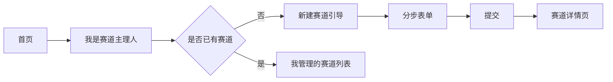
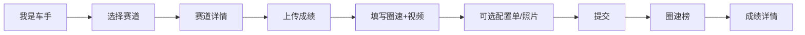
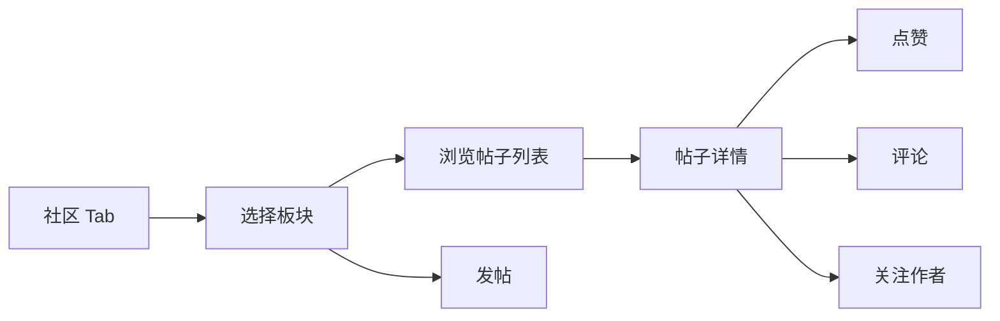

# 公园四驱车圈速打榜小程序 — 产品设计文档

| 版本 | 日期 | 说明 |
|------|------|------|
| v1.0 | 2026-06-18 | 初版 |

---

## 1. 产品概述

### 1.1 产品定位

面向**公园/户外迷你四驱车爱好者**的轻量级工具 + 社区小程序。核心解决两件事：

1. **圈速认定与打榜**：赛道主理人发布赛道，车手上传成绩认定视频，形成公开透明的圈速榜。
2. **车友交流**：以论坛形式组织讨论，降低新手门槛，促进赛道与装备信息流通。

### 1.2 设计原则

| 原则 | 说明 |
|------|------|
| **入口极简** | 首页仅两个身份入口 + 底部 Tab，不做功能堆砌 |
| **一步一屏** | 每个页面只完成一件事，表单分步提交 |
| **信息可验证** | 圈速榜与视频/配置单一一对应，减少争议 |
| **弱社交、强内容** | 社区以帖子和榜单为主，不做复杂关系链 |

### 1.3 目标用户

- **赛道主理人**：在公园固定位置维护赛道、审核/展示圈速的爱好者或组织者
- **车手**：参与圈速挑战、查看排名、交流改装与技巧的玩家
- **围观者**：浏览榜单与社区内容，尚未参赛的用户

---

## 2. 信息架构

### 2.1 全局导航

```
┌─────────────────────────────────────┐
│  首页（身份选择）                      │
│  ┌─────────────┐  ┌─────────────┐   │
│  │ 我是赛道主理人 │  │  我是车手    │   │
│  └─────────────┘  └─────────────┘   │
└─────────────────────────────────────┘

底部 Tab（登录后全局可见）：
[ 首页 ] [ 圈速榜 ] [ 社区 ] [ 我的 ]
```

- **首页**：身份入口 + 最近访问赛道快捷入口（可选，最多 3 条）
- **圈速榜**：按赛道浏览榜单（车手/主理人共用）
- **社区**：论坛板块列表与帖子流
- **我的**：个人资料、我的发布、我的关注、主理人管理入口

### 2.2 角色与权限

| 能力 | 游客 | 车手（已登录） | 赛道主理人 |
|------|------|----------------|------------|
| 浏览赛道/榜单/社区 | ✓ | ✓ | ✓ |
| 上传圈速成绩 | ✗ | ✓ | ✓ |
| 创建/编辑赛道 | ✗ | ✗ | ✓（本人创建的赛道） |
| 发帖/评论/点赞/关注 | ✗ | ✓ | ✓ |

> 说明：同一微信用户可同时是车手和主理人；「我是赛道主理人」入口进入主理人工作台，「我是车手」进入车手动线。

---

## 3. 核心功能设计

### 3.1 身份入口页（首页）

**页面目标**：3 秒内让用户明确「我要做什么」。

**布局**

```
┌──────────────────────────────┐
│  Logo + 产品名                 │
│  「公园四驱 · 圈速打榜」         │
├──────────────────────────────┤
│                              │
│   ┌────────────────────┐     │
│   │   我是赛道主理人      │     │  → 主理人工作台 / 创建赛道引导
│   └────────────────────┘     │
│                              │
│   ┌────────────────────┐     │
│   │     我是车手        │     │  → 赛道列表 / 上次选择的赛道
│   └────────────────────┘     │
│                              │
├──────────────────────────────┤
│  最近赛道（横向卡片，可省略）    │
└──────────────────────────────┘
│ Tab: 首页 | 圈速榜 | 社区 | 我的 │
└──────────────────────────────┘
```

**交互**

- 未登录点击需登录能力时，弹出微信授权（昵称、头像）
- 首次进入可跳过身份选择，通过底部 Tab 直接使用；身份按钮作为**快捷动线**而非强制分流

---

### 3.2 赛道主理人模块

#### 3.2.1 主理人工作台

**入口**：首页「我是赛道主理人」 / 我的 → 我管理的赛道

**内容**

- 我创建的赛道列表（卡片：名称、位置摘要、榜单人数、待处理事项数）
- 主操作：**+ 新建赛道**

#### 3.2.2 上传 / 编辑赛道信息

**表单字段**

| 字段 | 必填 | 类型 | 说明 |
|------|------|------|------|
| 赛道名称 | 是 | 文本 | 建议 ≤ 20 字，如「XX 公园北广场赛道」 |
| 赛道位置 | 是 | 地图选点 + 定位 | 调用 wx.chooseLocation / 地图选点，存经纬度 + 地址文案 |
| 所属主理人 | 是 | 文本 | 默认填充微信昵称，可修改 |
| 主理人联系方式 | 否 | 文本 | 微信号 / 手机，仅详情页「联系主理人」展示 |
| 成绩认定示例视频 | 否 | 视频 | ≤ 60s，用于告诉车手「怎样拍才算有效成绩」 |
| 赛道长度 | 否 | 数字 + 单位 | 单位：米，选填 |
| 赛道平面图 | 否 | 图片 | 最多 3 张，支持预览 |

**流程（分步，降低认知负担）**

```
Step 1 基本信息（名称、位置、主理人）
    ↓
Step 2 赛道详情（长度、平面图）
    ↓
Step 3 成绩认定说明（示例视频 + 文字补充，可选）
    ↓
提交成功 → 赛道详情页
```

**校验规则**

- 位置必须在地图选点完成后才可提交
- 视频大小、时长超限给出明确提示
- 同一主理人下赛道名称不可重复

#### 3.2.3 主理人后续能力（v1 建议范围）

- 编辑赛道基础信息
- 查看本赛道全部成绩条目（含视频链接）
- **v1 不做**成绩人工审核驳回，以「视频 + 规则示例」自助认定；后续版本可加「异议标记」

---

### 3.3 车手模块

#### 3.3.1 赛道列表 / 选择赛道

**入口**：首页「我是车手」 / 圈速榜 Tab

**列表卡片信息**

- 赛道名称
- 距离（基于用户定位计算，可选）
- 榜单 Top1 圈速 + 车手昵称
- 入榜人数

**筛选**：按距离排序 / 按名称搜索

#### 3.3.2 赛道详情页

**信息区（只读）**

| 模块 | 内容 |
|------|------|
| 头部 | 名称、主理人、长度（若有） |
| 位置 | 地址文案 + **导航**按钮（打开系统地图 App） |
| 平面图 | 图片 swiper |
| 认定说明 | 主理人示例视频 + 文字规则摘要 |
| 联系 | 主理人联系方式（若有，点击复制） |

**操作区**

- 主按钮：**查看圈速榜**
- 次按钮：**上传我的成绩**

#### 3.3.3 上传圈速成绩

**前置**：必须选择/进入某一赛道

**表单字段**

| 字段 | 必填 | 类型 | 说明 |
|------|------|------|------|
| 圈速 | 是 | 时间 | 格式 `分:秒.毫秒`，如 `0:32.58` |
| 成绩认定视频 | 是 | 视频 | 完整一圈，建议 ≤ 120s |
| 车型配置单 | 否 | 图片 / 文本 | 支持拍照或填写文字（马达、电池、改装要点） |
| 车辆照片 | 否 | 图片 | 最多 3 张 |
| 备注 | 否 | 文本 | ≤ 100 字 |

**提交流程**

```
选择赛道 → 填写圈速 → 上传视频 →（可选）配置单/照片 → 确认提交
```

**提交后**

- 自动进入该赛道圈速榜
- 若圈速优于本人历史最佳，更新个人最佳记录
- 不做主理人审核时，即时上榜（可在规则中声明「虚假成绩需社区监督」）

#### 3.3.4 圈速榜

**榜单页结构**

```
┌─────────────────────────────┐
│  [赛道名称 ▼]    共 N 人入榜   │
├─────────────────────────────┤
│ 1  昵称        0:32.58   ›  │
│ 2  昵称        0:33.01   ›  │
│ 3  昵称        0:33.12   ›  │
│ ...                         │
├─────────────────────────────┤
│ 我的排名：第 8 名 · 0:35.20  │
└─────────────────────────────┘
```

**排序规则**：圈速升序；相同圈速按提交时间先后（先提交者靠前）

**榜单项点击** → 成绩详情页

#### 3.3.5 成绩详情页

展示单次成绩的全部认定材料：

- 车手昵称、头像
- 圈速、提交时间、排名
- 成绩认定视频（播放器）
- 车型配置单（图/文）
- 车辆照片（图集）
- 备注

**隐私**：联系方式不在此页展示；视频默认公开（圈速榜性质决定）。

---

### 3.4 社区论坛模块

#### 3.4.1 板块预设

| 板块 | 定位 | 典型内容 |
|------|------|----------|
| 赛道/赛事专区 | 赛道活动、赛事通知、圈速讨论 | 「XX 公园周末交流赛」「这条赛道弯道技巧」 |
| 新手入门区 | 入门教程、规则科普 | 「第一次参赛要准备什么」 |
| 车手交流区 | 改装、手感、闲聊 | 「这款马达怎么配齿轮」 |
| 新品发布区 | 装备新品、开箱 | 「XX 牌新马达上手」 |

#### 3.4.2 帖子结构

| 元素 | 说明 |
|------|------|
| 标题 | 必填，≤ 50 字 |
| 正文 | 必填，支持纯文本；v1 可支持最多 9 图 |
| 所属板块 | 必选 |
| 关联赛道 | 选填，便于从赛道详情跳转相关讨论 |

#### 3.4.3 社区基础功能

| 功能 | 行为说明 |
|------|----------|
| **发帖** | 社区 Tab → 选择板块 → 发帖 |
| **列表** | 最新 / 热门（按点赞+评论加权）切换 |
| **帖子详情** | 正文 + 楼主信息 + 评论区 |
| **跟帖（评论）** | 一级评论；v1 不做多级楼中楼，保持简洁 |
| **点赞** | 帖子、评论均可点赞，可取消 |
| **关注** | 关注用户；「我的 → 关注」查看关注人新帖 |
| **分享** | 微信分享帖子/赛道/榜单（小程序卡片） |

#### 3.4.4 社区页面结构

```
社区 Tab
├── 顶部：板块 Tab 切换（4 个预设板块）
├── 帖子列表（标题、摘要、作者、点赞数、评论数、时间）
├── 右下角 FAB：发帖
└── 帖子详情
    ├── 正文
    ├── 点赞 | 评论数 | 分享
    └── 评论列表 + 底部输入框
```

---

## 4. 页面清单与路由

| 路径 | 页面名 | 说明 |
|------|--------|------|
| `/pages/index/index` | 首页 | 双入口 + 最近赛道 |
| `/pages/track/list` | 赛道列表 | 车手选赛道 |
| `/pages/track/detail` | 赛道详情 | 信息 + 导航 + 入口 |
| `/pages/track/edit` | 赛道编辑 | 主理人创建/编辑（分步） |
| `/pages/leaderboard/index` | 圈速榜 | 按赛道展示排名 |
| `/pages/record/detail` | 成绩详情 | 视频 + 配置单 + 照片 |
| `/pages/record/submit` | 上传成绩 | 车手提交圈速 |
| `/pages/community/index` | 社区首页 | 板块 + 帖子流 |
| `/pages/community/post` | 帖子详情 | 正文 + 评论 |
| `/pages/community/create` | 发帖 | 选板块 + 编辑 |
| `/pages/user/index` | 我的 | 资料 + 入口聚合 |
| `/pages/user/tracks` | 我管理的赛道 | 主理人 |
| `/pages/user/records` | 我的成绩 | 车手 |
| `/pages/user/following` | 我的关注 | 社区 |

---

## 5. 关键用户流程

### 5.1 主理人：创建赛道



### 5.2 车手：上传成绩并上榜



### 5.3 社区：浏览与互动



---

## 6. 数据模型（概要）

### 6.1 核心实体

```
User（用户）
├── openId, nickName, avatarUrl
├── roleFlags: driver | organizer
└── createdAt

Track（赛道）
├── id, name
├── location: { lat, lng, address }
├── organizerName, organizerContact?
├── length?, floorPlanImages[]
├── exampleVideo?
├── creatorId
└── createdAt, updatedAt

Record（圈速成绩）
├── id, trackId, userId
├── lapTime（毫秒存储，展示格式化）
├── videoUrl
├── configSheet?（text | imageUrl）
├── carPhotos[]
├── note?
└── createdAt

Post（帖子）
├── id, boardId, authorId
├── title, content, images[]
├── trackId?（关联赛道）
├── likeCount, commentCount
└── createdAt

Comment（评论）
├── id, postId, authorId, content
├── likeCount
└── createdAt

Like（点赞）
├── userId, targetType（post|comment）, targetId
└── createdAt

Follow（关注）
├── followerId, followeeId
└── createdAt
```

### 6.2 圈速排序

- 存储：`lapTimeMs`（整数毫秒）
- 展示：`M:SS.mmm` 或 `SS.mmm`（不足 1 分钟时不显示分钟）
- 索引：`(trackId, lapTimeMs ASC, createdAt ASC)`

---

## 7. UI / UX 规范

### 7.1 视觉风格

- **调性**：户外、轻量、竞技感；避免过度卡通
- **主色**：深绿或赛道绿（#2D6A4F）+ 白底 + 深灰文字
- **强调色**：用于 CTA 按钮、排名前三（金/银/铜可选）
- **圆角**：卡片 12px，按钮 8px
- **字体**：系统默认；圈速数字使用等宽或加粗突出

### 7.2 组件规范

| 组件 | 规范 |
|------|------|
| 主按钮 | 全宽或显著宽度，每屏最多 1 个主操作 |
| 列表 | 统一卡片式，左信息右箭头/数据 |
| 空状态 | 插画 + 一句说明 + 一个操作按钮 |
| 加载 | 骨架屏优于全屏 Loading |
| 表单 | 必填项标 `*`，选填项标注「选填」 |

### 7.3 简洁性检查清单

- [ ] 首页除双入口外，不超过 1 屏辅助信息
- [ ] 赛道详情：一屏内能看到「导航」和「上传成绩」
- [ ] 圈速榜：单屏至少展示 8 条排名
- [ ] 发帖：3 步内完成（选板块 → 写内容 → 发布）
- [ ] 全站不超过 2 级导航深度（Tab → 列表 → 详情）

---

## 8. 非功能需求

| 类别 | 要求 |
|------|------|
| 性能 | 首屏 ≤ 2s；视频采用 CDN + 封面预加载 |
| 存储 | 视频/图片走对象存储；数据库只存 URL 与元数据 |
| 合规 | 用户内容协议；举报入口（社区帖/评论，v1 可简化为「联系客服」） |
| 隐私 | 联系方式仅用户主动填写并展示；位置需授权说明 |
| 兼容 | 微信基础库 ≥ 2.20；iOS / Android 主流机型 |

---

## 9. MVP 范围与迭代建议

### 9.1 MVP（第一版必做）

- [x] 双身份入口与底部 Tab
- [x] 赛道 CRUD（主理人）
- [x] 圈速上传 + 榜单 + 成绩详情
- [x] 赛道导航跳转
- [x] 社区 4 板块 + 发帖/评论/点赞/关注
- [x] 微信登录与用户信息

### 9.2 v1.1 可选增强

- 成绩「异议/举报」与主理人备注
- 赛道收藏、车手个人主页
- 社区楼中楼回复、@ 提醒
- 榜单周期榜（周榜/月榜）
- 消息通知（评论、点赞、被超越）

### 9.3 明确不做（避免 scope 膨胀）

- 即时聊天 / 私信系统
- 复杂积分、勋章、等级体系
- 电商交易
- 多赛道联赛自动编排

---

## 10. 验收标准（摘要）

| 模块 | 验收点 |
|------|--------|
| 主理人 | 能创建带定位的赛道，他人可在地图 App 中导航至该位置 |
| 车手 | 能向指定赛道上传播放圈速视频，并在榜单中看到本人排名 |
| 榜单 | 点击任意条目可查看对应视频、配置单、照片 |
| 社区 | 4 个板块可发帖；点赞、评论、关注可用且状态正确 |
| 体验 | 新用户无需说明书即可完成「选赛道 → 看榜 → 发帖」路径 |

---

## 11. 附录：文案示例

**首页副标题**：选赛道，刷圈速，和车友一起玩。

**上传成绩引导**：请按主理人示例拍摄完整一圈，确保起终点清晰。

**空榜单**：还没有人挑战，来做第一个上榜的车手吧。

**社区发帖占位**：分享你的赛道见闻、改装心得或新手问题…

---

*文档结束。后续可在此基础上补充 UI 线框图、API 接口文档与数据库 DDL。*
